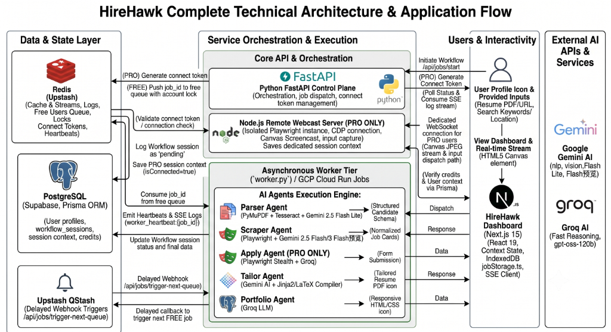

# HireHawk – AI-Powered Job Application Automation

HireHawk is a cutting-edge platform designed to streamline the job search and application process for professionals. Our mission is to empower job seekers by delivering personalized job recommendations, intelligent resume optimization tools, and a fast, efficient application experience using advanced AI.

---

## 🏗️ Technical Architecture & Application Flow



---

## 🔄 How HireHawk Works (Application Flow)

HireHawk operates through a seamless flow of data across three dedicated backend components. Here is the step-by-step lifecycle of a user on the platform:

### 1. User Onboarding & Validation (Next.js Frontend & API)
- The user visits the HireHawk web app and logs in securely using **NextAuth / Supabase Auth**.
- The **Next.js API** handles all initial request validations, ensuring the user has the correct credits and tier (FREE or PRO) before dispatching any work.

### 2. Jobs Server Connection (Node.js Session Server)
- If the user wants to apply to jobs automatically, they must connect their Jobs Platform account.
- **PRO Users only:** HireHawk spins up a headless browser via the **Node.js Session Server**. 
- The user interacts with this browser securely via a remote webcast (canvas) to log in. 
- Once successful, the secure connection context is saved to the PostgreSQL database for the AI agents to use later.

### 3. Agentic Job Execution (Python Backend)
When a user starts a job search or application flow, the Next.js API triggers the **Python Agentic Backend**. Execution depends on the user's tier:

- **PRO Tier (Instant):** The job is instantly dispatched to a dedicated **Cloud Run Worker**. It uses the user's dedicated Jobs Server connection (saved from Step 2) to search or apply for jobs.
- **FREE Tier (Queued):** The job is placed into a **Redis Queue**. A delayed **QStash** trigger processes the queue with a 25-45 second delay between jobs. It uses a shared Jobs Server account, ensuring rate limits are respected via a 30-minute lock.

### 4. Real-Time Feedback (Redis SSE)
- While the Python Worker (whether PRO or FREE) executes the AI pipelines (parsing resumes, tailoring LaTeX templates with Gemini, and filling forms with Groq), it publishes progress events to **Redis**.
- The Next.js frontend listens to these events via Server-Sent Events (SSE) and displays real-time progress to the user.

---

## 🔌 API Endpoints

### Workflow Orchestration (`/api/jobs/*`)

| Endpoint | Method | Purpose |
|----------|--------|---------|
| `/api/jobs/start` | POST | Start a new workflow (fetch or apply) |
| `/api/jobs/active` | GET | Get user's active session |
| `/api/jobs/stream` | GET | SSE real-time progress stream |
| `/api/jobs/status` | GET | Fallback status polling |
| `/api/jobs/cleanup` | POST | Delete old completed/failed sessions |
| `/api/jobs/trigger-next-queue`| POST | QStash callback to process next FREE tier job |

**Example: Start an apply_jobs workflow**
```bash
curl -X POST http://localhost:8000/api/jobs/start \
  -H "Content-Type: application/json" \
  -d '{
    "user_id": "user@example.com",
    "workflow_type": "apply_jobs",
    "input_data": {
      "resume_url": "https://storage.example.com/resume.pdf",
      "jobs": [
        {
          "job_url": "https://jobs.example.com/123456",
          "job_description": "Software Engineer..."
        }
      ]
    }
  }'
# Response: { "message": "Job started successfully", "job_id": "uuid-here" }
```

**Example: Stream progress (SSE)**
```bash
curl "http://localhost:8000/api/jobs/stream?job_id=uuid-here"
# SSE events: {"progress": 10, "status": "in_progress", "message": "Parsing resume..."}
#             {"progress": 50, "status": "in_progress", "message": "Scraping jobs..."}
#             {"progress": 100, "status": "done", "message": "Completed!"}
```

### Connection & Session

| Endpoint | Method | Purpose |
|----------|--------|---------|
| `/api/jobs-server/connect-token` | POST | Generate Redis token for Webcast connection flow |
| `/api/store-cookie` | POST | Receive session data from Webcast/Auth Server |
| `/logout` | DELETE | Disconnect Jobs Server session |

**Example: Generate connect token**
```bash
curl -X POST http://localhost:8000/api/jobs-server/connect-token \
  -H "Content-Type: application/json" \
  -d '{ "user_id": "user-uuid-here" }'
# Response: { "token": "random-uuid", "stream_server_url": "https://auth.example.com" }
```

### AI Tailoring & Generation

| Endpoint | Method | Purpose |
|----------|--------|---------|
| `/tailor` | POST | Generate AI-tailored resume |
| `/tailor/get-templates` | GET | Get available resume template previews |
| `/portfolio` | POST | Generate AI portfolio website |
| `/portfolio/get-templates`| GET | Get available portfolio template previews |

---

## 🗄️ Database Schema

HireHawk uses PostgreSQL via Supabase, mapped in the frontend using Prisma.

```prisma
model User {
  id                        String             @id @default(uuid()) @db.Uuid
  email                     String             @unique
  name                      String?
  resume_url                String?
  applied_jobs              String[]           
  jobs_server_context       Json?              // Webcast Session state
  context_updated_at        DateTime?
  user_data                 Json?              // Parsed resume cache
  profile_image             String?
  credits_last_reset        DateTime           @default(now())
  fetch_jobs_credits        Int                @default(2)
  shared_generation_credits Int                @default(5)
  tier                      TIER               @default(FREE)
  isConnected               Boolean            @default(false)
  workflow_sessions         workflow_sessions?
}

model workflow_sessions {
  id             String              @id @db.Uuid
  user_id        String              @unique(where: status IN ('pending','running','scraper_raw'))
  workflow_type  workflow_type_enum   
  status         session_status_enum  @default(pending)
  input_data     Json?               
  output_data    Json?               
  last_active_at DateTime            @default(now())
  created_at     DateTime            @default(now())
  user           User                @relation(fields: [user_id], references: [id])
}

enum TIER { FREE, PRO }
enum session_status_enum { pending, running, scraper_raw, completed, failed }
enum workflow_type_enum { fetch_jobs, apply_jobs }
```

---

## 🚀 Getting Started (Development)

### Prerequisites
- Node.js >= 20
- Python >= 3.10
- PostgreSQL (Supabase)
- Redis (Upstash)

### 1. Frontend Setup
```bash
cd my-fe
npm install
# Create .env.local with Supabase & Redis credentials
npx prisma generate
npm run dev
```

### 2. Backend API Setup
```bash
cd backend_python
python -m venv venv
source venv/bin/activate  # Or venv\Scripts\activate on Windows
pip install -r requirements.txt
playwright install chromium
# Create .env with GOOGLE_API, GROQ_API, REDIS_URL, SUPABASE_URL, etc.
uvicorn main:app --reload --port 8000
```

### 3. Auth Server Setup (Webcast)
```bash
cd auth-server
npm install
npm run dev
```

---

## 💰 Pricing Tiers & Limitations

| Feature | Basic (Free) | Pro |
|---------|-------------|-----|
| Fetch Jobs Credits | 2 per reset period | Unlimited |
| Shared Gen Credits | 5 per reset period | Unlimited |
| Execution Queue | Queued (shared, ~3.5 min wait) | Instant (Cloud Run) |
| Connection | Shared execution pool | Dedicated secure connection |

---

## 🔒 Security & Privacy
- User connections to the Jobs Server are handled exclusively via the headless Auth Server webcast, avoiding the need for a browser extension.
- Connections use stealth automation to ensure secure and isolated environment interactions.
- User context is stored securely in PostgreSQL as `JSONB` .
  
